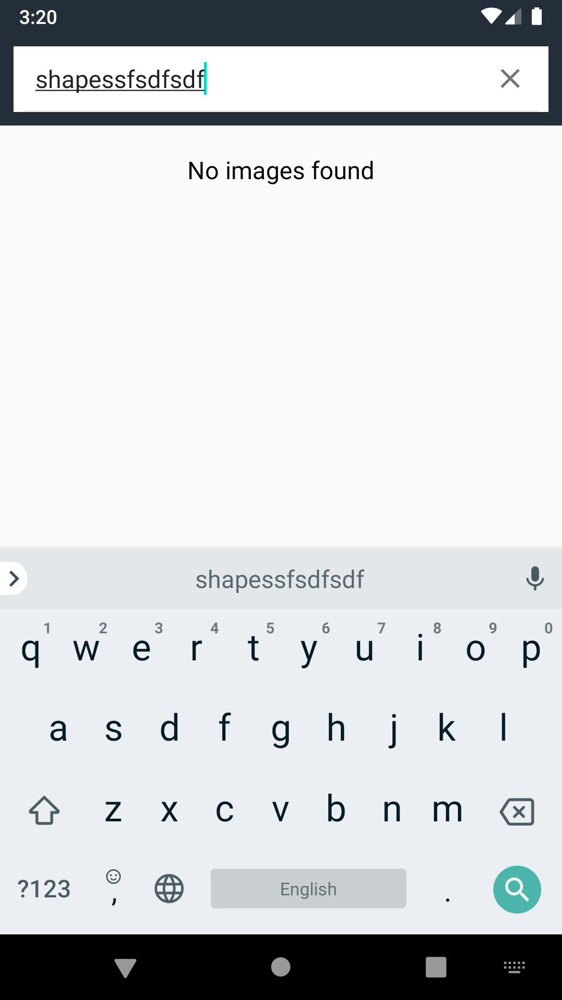

# image-search-app

# Sample android app with image search functionality using imgur API's

## Following are screenshots of sample app for phone
### Search images screen initial state

### Images search in progress

### Images search result

### Image details screen

### Network error screen

### No search results

## Following are screenshots of sample app for tablet
### Search images screen initial state

### Images search in progress

### Loading images after search query response

### Selected image details

### Selected image details with comments
